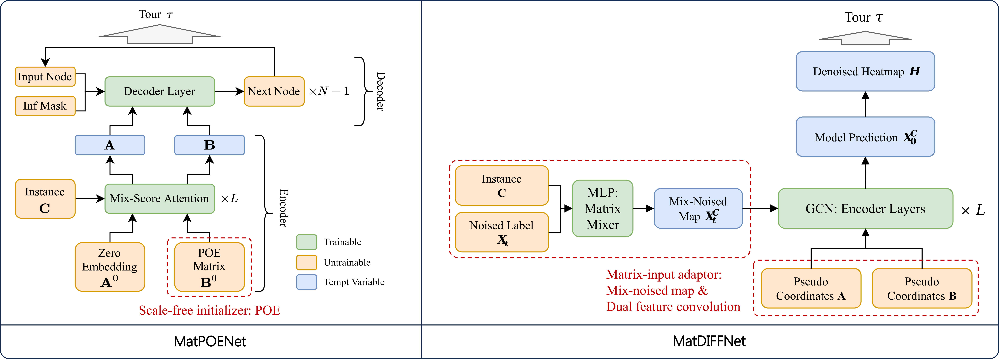

# UniCO: On Unified Combinatorial Optimization via Problem Reduction to Matrix-Encoded General TSP

This is the official implementation of our **ICLR 2025** paper "[UniCO: On Unified Combinatorial Optimization via Problem Reduction to Matrix-Encoded General TSP](https://openreview.net/forum?id=yEwakMNIex)".

## Brief Introduction
**Abstract:** Various neural solvers have been devised for combinatorial optimization (CO), which are often tailored for specific problem types, ranging from TSP, CVRP to SAT, etc. Yet, it remains an open question how to achieve universality regarding problem representing and learning with a general framework. This paper first proposes **UniCO**, to unify a set of CO problems by reducing them into the general TSP form featured by distance matrices. The applicability of this strategy is dependent on the efficiency of the problem reduction and solution transition procedures, which we show that at least ATSP, HCP, and SAT are readily feasible. The hope is to allow for the effective and even simultaneous use of as many types of CO instances as possible to train a neural TSP solver, and optionally finetune it for specific problem types. In particular, unlike the prevalent TSP benchmarks based on Euclidean instances with 2-D coordinates, our focused domain of general TSP could involve non-metric, asymmetric or discrete distances without explicit node coordinates, which is much less explored in TSP literature while poses new intellectual challenges. Along this direction, we devise two neural TSP solvers with and without supervision to conquer such matrix-formulated input, respectively: 1) **MatPOENet** and 2) **MatDIFFNet**. The former is a reinforcement learning-based sequential model with pseudo one-hot embedding (POE) scheme; and the latter is a Diffusion-based generative model with the mix-noised reference mapping scheme. Extensive experiments on ATSP, 2DTSP, HCP- and SAT-distributed general TSPs demonstrate the strong ability of our approaches towards arbitrary matrix-encoded TSP with structure and size variation.


Fig 1. The 3-step workflow of the UniCO learning framework, which is orthogonal and adaptable to different backbone models capable of solving general TSP.


Fig 2. General structure of the two proposed instantiation models, MatPOENet and MatDIFFNet, for UniCO.


This repository provides the implementation of **MatPOENet**, **MatDIFFNet** and **UniCO-DIMES**, which is in part developed on top of the code foundation of [MatNet](https://github.com/yd-kwon/MatNet), [T2TCO](https://github.com/Thinklab-SJTU/Fast-T2T), and [DIMES](https://github.com/DIMESTeam/DIMES). Experimental evaluations are conducted on **ATSP, 2DTSP, HCP- and SAT-distributed general TSPs**.

## Experimental Environment

- Basics
```bash
pip install torch==2.0.1
pip install scipy==1.10.1
pip install --no-index torch-scatter -f https://pytorch-geometric.com/whl/torch-2.0.1+cu117.html
pip install --no-index torch-sparse -f https://pytorch-geometric.com/whl/torch-2.0.1+cu117.html
pip install --no-index torch-spline-conv -f https://pytorch-geometric.com/whl/torch-2.0.1+cu117.html
pip install --no-index torch-cluster -f https://pytorch-geometric.com/whl/torch-2.0.1+cu117.html
```
- Additionally, MatDIFFNet is implemented with pytorch-lightning and ml4co-kit.
```bash
pip install wandb==0.16.3
pip install pytorch-lightning==2.0.1
pip install ml4co-kit
```

## Pre-trained Weights
- MatPOENet: Pre-trained weights can be downloaded [here](https://drive.google.com/file/d/16mDY9HVzDdyFnqrL6YnrQ2lS8twscD_o/view?usp=sharing).

- MatDIFFNet: Pre-trained weights can be downloaded [here](https://drive.google.com/drive/folders/1YHzcji4rqL2hxMpZWpZcmp7KKvv8ukJT?usp=sharing).

- UniCO-DIMES: Pre-trained weights are provided with codes. 

Please place the unzipped `.pt` files under `ckpts` folder for evaluation. 

## Test Datasets
We provide the full test data for fair and consistent comparison of future research:
- MatPOENet. `N = 20` data are provided with codes (./data). Please download datasets for other scales [here](https://drive.google.com/file/d/17LINJtArttm8ba6VEQ4XdfGjuz-ZMl3I/view?usp=sharing) and place `val_sets` and `test_sets` under `data` folder for full evaluation and testing. 

- MatDIFFNet. Please download datasets [here](https://drive.google.com/drive/folders/1HI-0GR9rh9HLFM7ouf8Jpn4WAY1CuDf4?usp=sharing).

## Training Datasets
- For UniCO-MatPOENet and UniCO-DIMES, batched instances of all problem types are generated synchronously during training. 

- For UniCO-MatDIFFNet, training data of binary distances (i.e., HCP and SAT) are generated on the fly, while training data for TSP and ATSP require preparation in advance by running `utils/generate_data.py`. Note that the datasets are generated in txt format and need to be specified in `MatDIFFNet/train.py`.

## Quickstart 
### UniCO-MatPOENet
Run following lines for your quick reference on TSP-20:
```
cd MatPOENet
python train.py
python test.py
```

### UniCO-MatDIFFNet
Run following lines for your quick reference on TSP-50:
```
cd MatDIFFNet
python train.py
python test.py
```

### UniCO-DIMES
Run following lines for your quick reference on TSP-20:
```
cd UniCO-DIMES
python train.py
python test.py
```

## Citation and Credits
If you find this work useful, please cite our paper as:
```
@inproceedings{
pan2025unico,
title={UniCO: On Unified Combinatorial Optimization via Problem Reduction to Matrix-Encoded General TSP},
author={Wenzheng Pan and Hao Xiong and Jiale Ma and Wentao Zhao and Yang Li and Junchi Yan},
booktitle={The Thirteenth International Conference on Learning Representations},
year={2025},
url={https://openreview.net/forum?id=yEwakMNIex}
}
```
