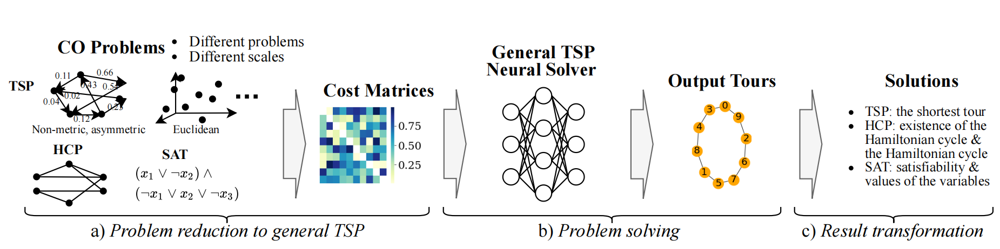

# UniCO

This is the official implementation of our **ICLR 2025** paper "[UniCO: On Unified Combinatorial Optimization via Problem Reduction to Matrix-Encoded General TSP](TODO)".

## Brief Introduction
This paper first proposes **UniCO**, to unify a set of CO problems by reducing them into the general TSP form featured by distance matrices. The applicability of this strategy is dependent on the efficiency of the problem reduction and solution transition procedures, which we show that at least ATSP, HCP, and SAT are readily feasible. The hope is to allow for the effective and even simultaneous use of as many types of CO instances as possible to train a neural TSP solver, and optionally finetune it for specific problem types. In particular, unlike the prevalent TSP benchmarks based on Euclidean instances with 2-D coordinates, our focused domain of general TSP could involve non-metric, asymmetric or discrete distances without explicit node coordinates, which is much less explored in TSP literature while poses new intellectual challenges. Along this direction, we devise two neural TSP solvers with and without supervision to conquer such matrix-formulated input, respectively: 1) **MatPOENet** and 2) **MatDIFFNet**. The former is a reinforcement learning-based sequential model with pseudo one-hot embedding (POE) scheme; and the latter is a Diffusion-based generative model with the mix-noised reference mapping scheme.


Fig 1. The 3-step workflow of the UniCO learning framework.


Fig 2. General structure of the two proposed instantiation models, MatPOENet and MatDIFFNet, for UniCO.


This repository provides the implementation of **MatPOENet**, **MatDIFFNet** and **UniCO-DIMES**, which is in part developed on top of the code foundation of [MatNet](https://github.com/yd-kwon/MatNet), [T2TCO](https://github.com/Thinklab-SJTU/Fast-T2T), and [DIMES](https://github.com/DIMESTeam/DIMES). Experimental evaluations are conducted on **ATSP, 2DTSP, HCP- and SAT-distributed general TSPs**.

## Experimental Environment

TODO (dependencies, etc)

## Pre-trained Weights
- MatPOENet: Pre-trained weights can be downloaded [here](https://drive.google.com/file/d/16mDY9HVzDdyFnqrL6YnrQ2lS8twscD_o/view?usp=sharing).

- MatDIFFNet: Pre-trained weights can be downloaded [here]().

- UniCO-DIMES: Pre-trained weights are provided with codes. 

Please place the unzipped `.pt` files under `ckpts` folder for evaluation. 

## Datasets
- Test Datasets. `N = 20` data are provided with codes (./data). Please download datasets for other scales [here](https://drive.google.com/file/d/17LINJtArttm8ba6VEQ4XdfGjuz-ZMl3I/view?usp=sharing) and place `val_sets` and `test_sets` under `data` folder for full evaluation and testing. 

- Training Datasets. For MatPOENet and UniCO-DIMES, training data are randomly generated on the fly. For MatDIFFNet, the training data can be downloaded [here]().

## Quickstart 

<!-- Note that you can modify arguments specified in `train.py` and `test.py` respectively for customized execution. -->

<!-- Prior to training/testing, run:
```
gcc utils/base_methods.c -o libtsp.so -fPIC -shared
``` -->

### MatPOENet
Run following lines for your quick reference on TSP-20:
```
cd MatPOENet
python train.py
python test.py
```

### MatDIFFNet
Run following lines for your quick reference on TSP-50:
```
cd MatDIFFNet
python train.py
python test.py
```


### UniCO-DIMES
Run following lines for your quick reference on TSP-20:
```
cd UniCO-DIMES
python train.py
python test.py
```

## Citation and Credits
If you find this work useful, please cite our paper as:
```
@inproceedings{
pan2025UniCO,
title={UniCO: On Unified Combinatorial Optimization via Problem Reduction to Matrix-Encoded General TSP},
author={Wenzheng Pan and Hao Xiong and Jiale Ma and Wentao Zhao and Yang Li and Junchi Yan},
booktitle={The Thirteenth International Conference on Learning Representations},
year={2025},
}
```

<!-- Training results and checkpoints shall be stored in `result` folder for either model. -->